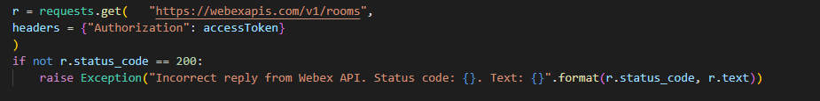
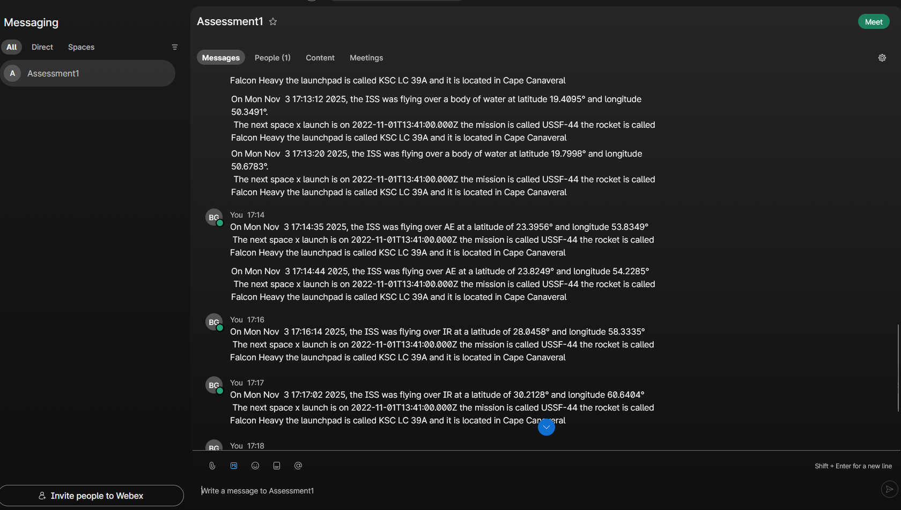
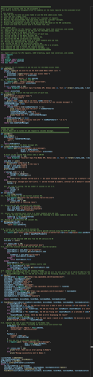

# 🚀 Space Bot API Investigation Sheet
**Total Marks: 30**
**Part 1: Collect Required API Documentation**
This investigation sheet helps you gather key technical information from the three
APIs required for the Space Bot project: **Webex Messaging API**, **ISS Current
Location API**, and a **Geocoding API** (LocationIQ or Mapbox or other), plus the
Python time module.
---
## Section 1: Webex Messaging API (7 marks)✅
| Criteria | Details |
|---------|---------|
| API Base URL | `https://webexapis.com/v1` |
| Authentication Method | `Requires a Authentication key` |
| Endpoint to list rooms | `https://webexapis.com/v1/rooms` |
| Endpoint to get messages | `https://webexapis.com/v1/messages` |
| Endpoint to send message | `https://webexapis.com/v1/messages` |
| Required headers | `Authorization` |
| Sample full GET or POST request |see below |
    r = requests.get("https://webexapis.com/v1/messages", 
        params ={
            "roomId": roomIdToGetMessages,
            "max": 1
            }, 
        headers = {"Authorization": accessToken}
        )
---
## Section 2: ISS Current Location API (3 marks)
| Criteria | Details |
|---------|---------|
| API Base URL | `http://api.open-notify.org/` |
| Endpoint for current ISS location | `http://api.open-notify.org/iss-now.json` |
| Sample response format (example JSON) | see below |
```
{
    'timestamp': 1762188573, 
    'message': 'success', 
    'iss_position': {'latitude': '-46.0277', 
                    'longitude': '-15.0436'
                    }
}
```
|
---
## Section 3: Geocoding API (LocationIQ or Mapbox or other) (6 marks)
| Criteria | Details |
|---------|---------|
| Provider used (circle one) | `openweather api`|
| API Base URL | `https://api.openweathermap.org/data/2.5/` |
| Endpoint for reverse geocoding | `https://api.openweathermap.org/data/2.5/weather?lat={lat}&lon={lon}&appid={API key}` |
| Authentication method | `Requires a Authentication key` |
| Required query parameters | `the required query parameters are lat (latitude) lon (longditude) and the appid (your api key)` |
| Sample request with latitude/longitude | see below |`    
    r = requests.get(f"https://api.openweathermap.org/data/2.5/weather?lat={40.75}&lon={-73.99}&appid={AUTHENTICATIONKEY}", 
        params = {"appid": APIKEYHERE}  
        )` 
| Sample JSON response (formatted example) |
```
{
  "coord": {
    "lon": -73.99,
    "lat": 40.75
  },
  "weather": [
    {
      "id": 804,
      "main": "Clouds",
      "description": "overcast clouds",
      "icon": "04d"
    }
  ],
  "base": "stations",
  "main": {
    "temp": 288.06,
    "feels_like": 287.2,
    "temp_min": 287.2,
    "temp_max": 288.81,
    "pressure": 1015,
    "humidity": 61,
    "sea_level": 1015,
    "grnd_level": 1013
  },
  "visibility": 10000,
  "wind": {
    "speed": 4.63,
    "deg": 190
  },
  "clouds": {
    "all": 100
  },
  "dt": 1762191627,
  "sys": {
    "type": 2,
    "id": 2090253,
    "country": "US",
    "sunrise": 1762169334,
    "sunset": 1762206604
  },
  "timezone": -18000,
  "id": 5106184,
  "name": "Weehawken",
  "cod": 200
}
```
|
---
## 🚀 Section 4: Epoch to Human Time Conversion (Python time module) (2 marks)
| Criteria | Details |
|---------|---------|
| Library used | `time` |
| Function used to convert epoch | `time.ctime()` |
| Sample code to convert timestamp | see below |
```
timestamp = 1730663230
timeString = time.ctime(timestamp)
print(timeString)
```
|
| Output (human-readable time) | `Mon Nov 03 18:47:10 2025` |
---
## 🚀 Section 5: Web Architecture & MVC Design Pattern (12 marks)
### 🚀 Web Architecture – Client-Server Model
- **Client**: The client in this instance is space_iss.py running locally this piece of software makes requests to various api servers  
- **Server**: The server in this instance host the multiple api's that are called by the client  
- (Explain the communication between them & include a block diagram )


### 🚀 RESTful API Usage
-
-
-
### 🚀 MVC Pattern in Space Bot
| Component | Description |
|------------|-------------|
| **Model** | The apis that are called within the code e.g. open weather api, webex api and the iss api|
| **View** | The output that the user interacts with in this case its the webex chat window that the result gets sent to|
| **Controller** | The controller represents the python program that co-ordinates recieveing and posting to the various apis|
#### Example:
- Model: the api calls made from the python program

- View: the webex chat window that shows the result

- Controller: the python program

---
### 🚀 Notes
- Use official documentation for accuracy (e.g. developer.webex.com, locationiq.com
or Mapbox, open-notify.org or other ISS API).
- Be prepared to explain your findings to your instructor or demo how you retrieved
them using tools like Postman, Curl, or Python scripts.
---
### Total: /30